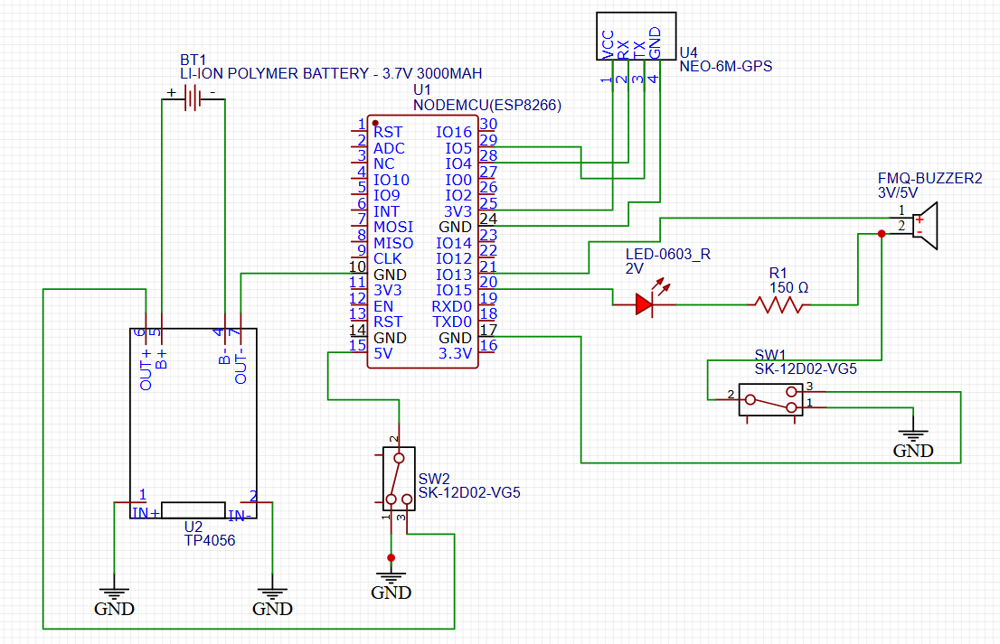

# CASELAP
## Required Components
1. 2 ESP8266 microcontrollers
2. 1 NEO-6M GPS Module
3. 1 red LED
4. 1 buzzer
5. 1 resistor
6. 2 SPDT switch
7. 1 charging module (TP4056 in this case)
8. 3.7V LiPo battery 

## Circuit Diagram

The circuit diagram for the transmitter is shown below. (If any error occurs, feel free to message me)

## Instructions

This alert and monitoring system utilizes ESP-NOW to send the data to the receiver ESP8266. 
To setup the transmitter, simply run the **capstone_final_tx.ino** in the Arduino IDE. 
For the receiver, setup the microcontroller by connecting it using a micro-USB cable to another laptop, this will be the receiver setup. 
Upload the code **capstone_final_rx.ino** and close the serial monitor (this is so that when data from the port is read there is no interruption). 
Afterwards, run the Python script **gps_logger.py**, once you have reached the required time interval press _Ctrl + C_ to stop the logging and then check the _**.xlsx file**_ for the data log.

## Receiver Setup

The receiver ESP8266 is simply just connected to a laptop that runs **caselap-rx.ino**